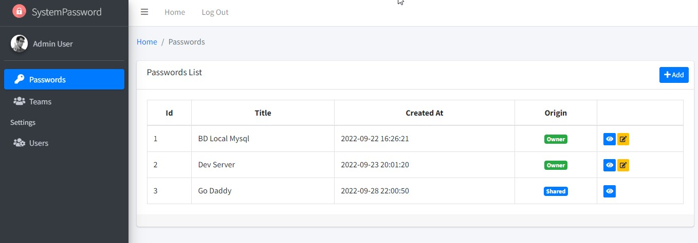

# System Password

This is Laravel Project to store and share passwords.
This App allows storing passwords and sharing with other users of the system o with a team.

## Features
- Login System (Auth, password recovery)
- Create user (Admin)
- Create Teams (Admin)
- Store Password (All users)
- Share Password (All users)
- UI (AdminLTE)

### Requirements
PHP >= 8.0

### Installation
- `composer install`
- `cp .env.example .env`

Set DB and Mail Credentials in the .env File
* DB_HOST=localhost
* DB_DATABASE=your_DB
* DB_USERNAME=root
* DB_PASSWORD=

* MAIL_MAILER=smtp
* MAIL_HOST=0.0.0.0
* MAIL_PORT=1025
* MAIL_USERNAME=null
* MAIL_PASSWORD=null
* MAIL_ENCRYPTION=null

- `php artisan key:generate`

Run migrations and Seeders
- `php artisan migrate --seed`

Admin User:
admin@example.com  Pass: password

## License
[MIT license](https://opensource.org/licenses/MIT).
